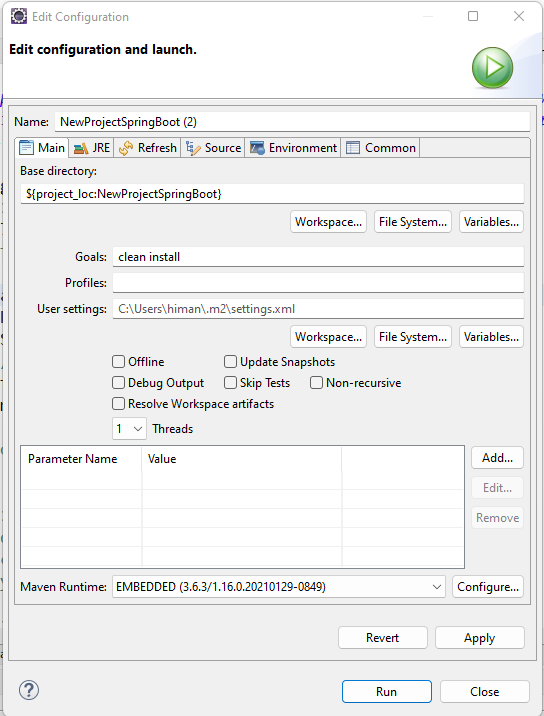

# Deploying a Spring Boot Application on AWS Elastic Cloud Compute(EC2) instance

In this ReadMe I will share the steps to deploy a Spring Boot web application on Amazon EC2

## Tech Stack used in the deployment

- [Java 11] - Java needs to be installed.
- [Sprint Boot Application] - A running Sprint Boot Application
- [Apache Tomcat] - Tomcat server for deployment

### Steps for deploying the application
	1. Create a WAR file of your Spring Boot Project
	2. Create an EC2 instance on the AWS console
	3. Install Java and Tomcat server on EC2
	4. Give permission to the user in tomcat to access Manage apps on the GUI
	5. Remove default localhost URL in Tomcat settings
	6. Select the WAR file and deploy it

### Step 1: Create a WAR file of your Spring Boot Project
In pom.xml, add war packaging configuration as shown below:

<packaging>war</packaging>

The screenshots are shown below: 

Once you click on the Maven build, the “Edit Configuration” window will be opened. 
Write the command “clean install” in Goals and click on Run.
Maven Clean install on Eclipse is shown below: 

The generated WAR file is present in the target folder in the project structure.

### Step 2: Create an EC2 instance on the AWS console

### Step 3: Install Java and Tomcat server on EC2

### Step 4: Give permission to the user in tomcat to access Manage apps on the GUI

### Step 5: Remove default localhost URL in Tomcat settings

### Step 6: Select the WAR file and deploy it

